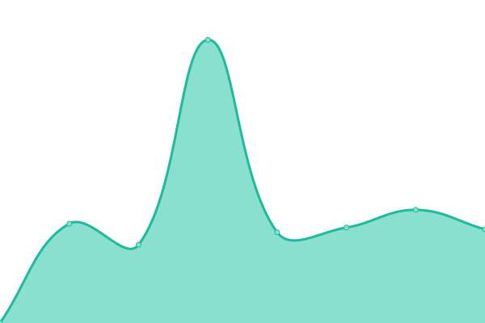
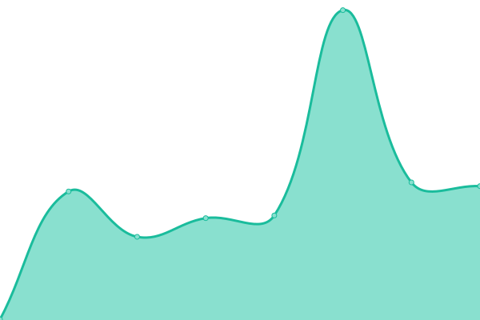
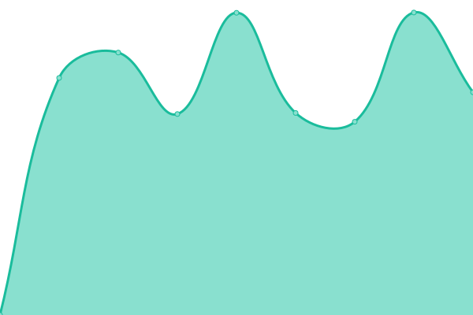
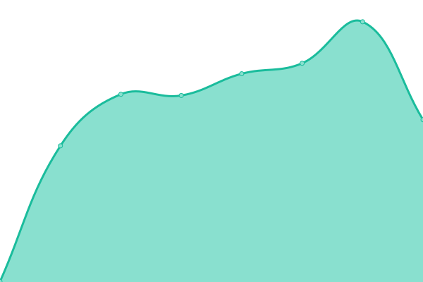
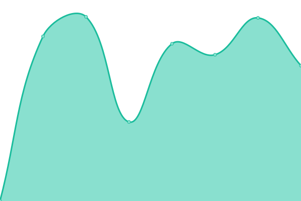
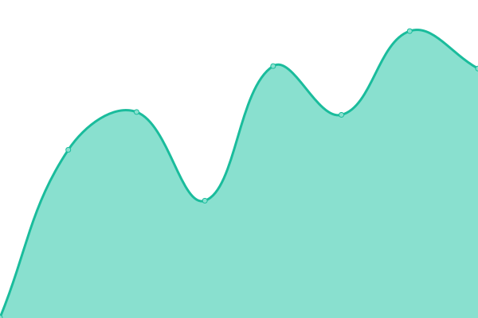
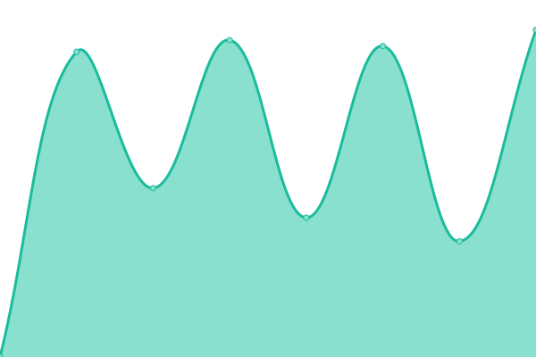
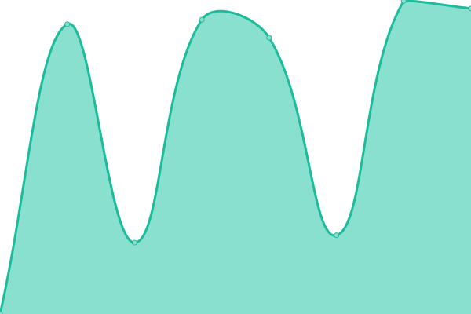
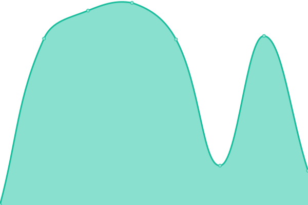

# [📈 Live Status](https://yorsh21.github.io/sites-status): <!--live status--> **🟧 Partial outage**

This repository contains the open-source uptime monitor and status page for [Jorge Villagrán](http://insive.cl), powered by [Upptime](https://github.com/upptime/upptime).

With [Upptime](https://upptime.js.org), you can get your own unlimited and free uptime monitor and status page, powered entirely by a GitHub repository. We use [Issues](https://github.com/yorsh21/sites-status/issues) as incident reports, [Actions](https://github.com/yorsh21/sites-status/actions) as uptime monitors, and [Pages](https://yorsh21.github.io/sites-status) for the status page.

<!--start: status pages-->
<!-- This summary is generated by Upptime (https://github.com/upptime/upptime) -->
<!-- Do not edit this manually, your changes will be overwritten -->
<!-- prettier-ignore -->
| URL | Status | History | Response Time | Uptime |
| --- | ------ | ------- | ------------- | ------ |
|  [Insive](https://insive.cl) | 🟩 Up | [insive.yml](https://github.com/yorsh21/sites-status/commits/HEAD/history/insive.yml) | 

 312ms
     
 | 

<a href="https://yorsh21.github.io/sites-status/history/insive">100.00%</a>
    

|  [Brandboost](https://brandboost.cl/) | 🟩 Up | [brandboost.yml](https://github.com/yorsh21/sites-status/commits/HEAD/history/brandboost.yml) | 

 333ms
     
 | 

<a href="https://yorsh21.github.io/sites-status/history/brandboost">100.00%</a>
    

|  [Blinhost](https://blinhost.cl/) | 🟩 Up | [blinhost.yml](https://github.com/yorsh21/sites-status/commits/HEAD/history/blinhost.yml) | 

 357ms
     
 | 

<a href="https://yorsh21.github.io/sites-status/history/blinhost">100.00%</a>
    

|  [Gruber Site](https://app.gruber.cl/) | 🟩 Up | [gruber-site.yml](https://github.com/yorsh21/sites-status/commits/HEAD/history/gruber-site.yml) | 

 583ms
     
 | 

<a href="https://yorsh21.github.io/sites-status/history/gruber-site">100.00%</a>
    

|  [Gruber API](https://app.gruber.cl/) | 🟩 Up | [gruber-api.yml](https://github.com/yorsh21/sites-status/commits/HEAD/history/gruber-api.yml) | 

 122ms
     
 | 

<a href="https://yorsh21.github.io/sites-status/history/gruber-api">100.00%</a>
    

|  [Seguridad en Linea](https://seguridadenlinea.cl/) | 🟩 Up | [seguridad-en-linea.yml](https://github.com/yorsh21/sites-status/commits/HEAD/history/seguridad-en-linea.yml) | 

 332ms
     
 | 

<a href="https://yorsh21.github.io/sites-status/history/seguridad-en-linea">100.00%</a>
    

|  [Master Seguridad](https://www.masterseguridad.cl/) | 🟩 Up | [master-seguridad.yml](https://github.com/yorsh21/sites-status/commits/HEAD/history/master-seguridad.yml) | 

 2995ms
     
 | 

<a href="https://yorsh21.github.io/sites-status/history/master-seguridad">100.00%</a>
    

|  [Escuela de Seguridad](https://escueladeseguridad.cl/) | 🟩 Up | [escuela-de-seguridad.yml](https://github.com/yorsh21/sites-status/commits/HEAD/history/escuela-de-seguridad.yml) | 

 1299ms
     
 | 

<a href="https://yorsh21.github.io/sites-status/history/escuela-de-seguridad">100.00%</a>
    

|  [Limpex](https://limpex.cl/) | 🟩 Up | [limpex.yml](https://github.com/yorsh21/sites-status/commits/HEAD/history/limpex.yml) | 

 2206ms
     
 | 

<a href="https://yorsh21.github.io/sites-status/history/limpex">100.00%</a>
    

|  [Bettersport](https://bettersport.cl/) | 🟩 Up | [bettersport.yml](https://github.com/yorsh21/sites-status/commits/HEAD/history/bettersport.yml) | 

 2345ms
     
 | 

<a href="https://yorsh21.github.io/sites-status/history/bettersport">100.00%</a>
    

|  [Lumisolar Chile](https://lumisolar.cl/) | 🟩 Up | [lumisolar-chile.yml](https://github.com/yorsh21/sites-status/commits/HEAD/history/lumisolar-chile.yml) | 

 1681ms
     
 | 

<a href="https://yorsh21.github.io/sites-status/history/lumisolar-chile">100.00%</a>
    

|  [Lumisolar Perú](https://www.lumisolar.pe/) | 🟩 Up | [lumisolar-peru.yml](https://github.com/yorsh21/sites-status/commits/HEAD/history/lumisolar-peru.yml) | 

 1028ms
     
 | 

<a href="https://yorsh21.github.io/sites-status/history/lumisolar-peru">100.00%</a>
    

|  [Genera Industrial](https://generaindustrial.cl/) | 🟩 Up | [genera-industrial.yml](https://github.com/yorsh21/sites-status/commits/HEAD/history/genera-industrial.yml) | 

 370ms
     
 | 

<a href="https://yorsh21.github.io/sites-status/history/genera-industrial">100.00%</a>
    

|  [Aromalimeno](https://aromalimeno.cl/) | 🟩 Up | [aromalimeno.yml](https://github.com/yorsh21/sites-status/commits/HEAD/history/aromalimeno.yml) | 

 1512ms
     
 | 

<a href="https://yorsh21.github.io/sites-status/history/aromalimeno">100.00%</a>
    

|  [Papelera Rio Claro](https://papelerarioclaro.cl/) | 🟩 Up | [papelera-rio-claro.yml](https://github.com/yorsh21/sites-status/commits/HEAD/history/papelera-rio-claro.yml) | 

 285ms
     
 | 

<a href="https://yorsh21.github.io/sites-status/history/papelera-rio-claro">100.00%</a>
    

|  [Houselegal](https://houselegal.cl/) | 🟩 Up | [houselegal.yml](https://github.com/yorsh21/sites-status/commits/HEAD/history/houselegal.yml) | 

 282ms
     
 | 

<a href="https://yorsh21.github.io/sites-status/history/houselegal">100.00%</a>
    

|  [Bioproject](https://bioproject.cl/) | 🟩 Up | [bioproject.yml](https://github.com/yorsh21/sites-status/commits/HEAD/history/bioproject.yml) | 

 622ms
     
 | 

<a href="https://yorsh21.github.io/sites-status/history/bioproject">100.00%</a>
    

|  [Acho](https://acho.cl/) | 🟩 Up | [acho.yml](https://github.com/yorsh21/sites-status/commits/HEAD/history/acho.yml) | 

 1953ms
     
 | 

<a href="https://yorsh21.github.io/sites-status/history/acho">100.00%</a>
    

|  [Somevip](https://somevip.cl/) | 🟩 Up | [somevip.yml](https://github.com/yorsh21/sites-status/commits/HEAD/history/somevip.yml) | 

 2852ms
     
 | 

<a href="https://yorsh21.github.io/sites-status/history/somevip">100.00%</a>
    

|  [Correctm](https://correctm.cl/) | 🟥 Down | [correctm.yml](https://github.com/yorsh21/sites-status/commits/HEAD/history/correctm.yml) | 

 0ms
     
 | 

<a href="https://yorsh21.github.io/sites-status/history/correctm">0.00%</a>
    

|  [Donbarry](https://donbarry.cl/) | 🟥 Down | [donbarry.yml](https://github.com/yorsh21/sites-status/commits/HEAD/history/donbarry.yml) | 

 0ms
     
 | 

<a href="https://yorsh21.github.io/sites-status/history/donbarry">0.00%</a>
    

|  [Rememberyou](https://rememberyou.cl/) | 🟥 Down | [rememberyou.yml](https://github.com/yorsh21/sites-status/commits/HEAD/history/rememberyou.yml) | 

 0ms
     
 | 

<a href="https://yorsh21.github.io/sites-status/history/rememberyou">0.00%</a>
    

|  [Myathletecoach](https://myathletecoach.cl/) | 🟩 Up | [myathletecoach.yml](https://github.com/yorsh21/sites-status/commits/HEAD/history/myathletecoach.yml) | 

 2074ms
     
 | 

<a href="https://yorsh21.github.io/sites-status/history/myathletecoach">100.00%</a>
    

|  [Resva](https://resva.cl/) | 🟥 Down | [resva.yml](https://github.com/yorsh21/sites-status/commits/HEAD/history/resva.yml) | 

 0ms
     
 | 

<a href="https://yorsh21.github.io/sites-status/history/resva">0.00%</a>
    

<!--end: status pages-->

[**Visit our status website →**](https://yorsh21.github.io/sites-status)

## 📄 License

- Powered by: [Upptime](https://github.com/upptime/upptime)
- Code: [MIT](./LICENSE) © [Jorge Villagrán](http://insive.cl)
- Data in the `./history` directory: [Open Database License](https://opendatacommons.org/licenses/odbl/1-0/)
