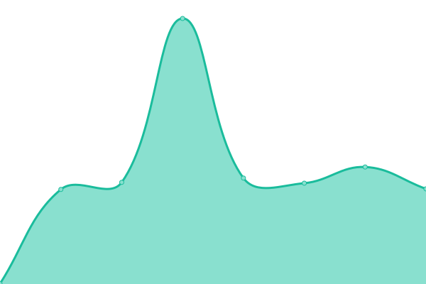

# [📈 Live Status](https://yorsh21.github.io/sites-status): <!--live status--> **🟧 Partial outage**

This repository contains the open-source uptime monitor and status page for [Jorge Villagrán](http://insive.cl), powered by [Upptime](https://github.com/upptime/upptime).

With [Upptime](https://upptime.js.org), you can get your own unlimited and free uptime monitor and status page, powered entirely by a GitHub repository. We use [Issues](https://github.com/yorsh21/sites-status/issues) as incident reports, [Actions](https://github.com/yorsh21/sites-status/actions) as uptime monitors, and [Pages](https://yorsh21.github.io/sites-status) for the status page.

<!--start: status pages-->
<!-- This summary is generated by Upptime (https://github.com/upptime/upptime) -->
<!-- Do not edit this manually, your changes will be overwritten -->
<!-- prettier-ignore -->
| URL | Status | History | Response Time | Uptime |
| --- | ------ | ------- | ------------- | ------ |
|  [Insive](https://insive.cl) | 🟥 Down | [insive.yml](https://github.com/yorsh21/sites-status/commits/HEAD/history/insive.yml) | 

 2394ms
     
 | 

<a href="https://yorsh21.github.io/sites-status/history/insive">86.97%</a>
    

|  [iLuch](https://iluch.com) | 🟥 Down | [i-luch.yml](https://github.com/yorsh21/sites-status/commits/HEAD/history/i-luch.yml) | 

 2283ms
     
 | 

<a href="https://yorsh21.github.io/sites-status/history/i-luch">87.14%</a>
    

|  [Blinhost](https://blinhost.cl) | 🟥 Down | [blinhost.yml](https://github.com/yorsh21/sites-status/commits/HEAD/history/blinhost.yml) | 

 1973ms
     
 | 

<a href="https://yorsh21.github.io/sites-status/history/blinhost">87.45%</a>
    

|  [Gruber Site](https://gruserv.com) | 🟥 Down | [gruber-site.yml](https://github.com/yorsh21/sites-status/commits/HEAD/history/gruber-site.yml) | 

 2032ms
     
 | 

<a href="https://yorsh21.github.io/sites-status/history/gruber-site">87.76%</a>
    

|  [Gruserv API](https://app.gruserv.com) | 🟥 Down | [gruserv-api.yml](https://github.com/yorsh21/sites-status/commits/HEAD/history/gruserv-api.yml) | 

 0ms
     
 | 

<a href="https://yorsh21.github.io/sites-status/history/gruserv-api">0.00%</a>
    

|  [Segurapp Site](https://segurapp.cl) | 🟥 Down | [segurapp-site.yml](https://github.com/yorsh21/sites-status/commits/HEAD/history/segurapp-site.yml) | 

 3350ms
     
 | 

<a href="https://yorsh21.github.io/sites-status/history/segurapp-site">87.93%</a>
    

|  [Segurapp APP](http://app.segurapp.cl) | 🟩 Up | [segurapp-app.yml](https://github.com/yorsh21/sites-status/commits/HEAD/history/segurapp-app.yml) | 

 308ms
     
 | 

<a href="https://yorsh21.github.io/sites-status/history/segurapp-app">100.00%</a>
    

|  [Seguridad en Linea](https://seguridadenlinea.cl) | 🟩 Up | [seguridad-en-linea.yml](https://github.com/yorsh21/sites-status/commits/HEAD/history/seguridad-en-linea.yml) | 

 446ms
     
 | 

<a href="https://yorsh21.github.io/sites-status/history/seguridad-en-linea">100.00%</a>
    

|  [Master Seguridad](https://masterseguridad.cl) | 🟥 Down | [master-seguridad.yml](https://github.com/yorsh21/sites-status/commits/HEAD/history/master-seguridad.yml) | 

 2432ms
     
 | 

<a href="https://yorsh21.github.io/sites-status/history/master-seguridad">88.09%</a>
    

|  [Escuela de Seguridad](https://escueladeseguridad.cl) | 🟥 Down | [escuela-de-seguridad.yml](https://github.com/yorsh21/sites-status/commits/HEAD/history/escuela-de-seguridad.yml) | 

 3204ms
     
 | 

<a href="https://yorsh21.github.io/sites-status/history/escuela-de-seguridad">88.54%</a>
    

|  [Limpex](https://limpex.cl) | 🟥 Down | [limpex.yml](https://github.com/yorsh21/sites-status/commits/HEAD/history/limpex.yml) | 

 999ms
     
 | 

<a href="https://yorsh21.github.io/sites-status/history/limpex">88.70%</a>
    

|  [Sportsalud](https://sportsalud.cl/) | 🟥 Down | [sportsalud.yml](https://github.com/yorsh21/sites-status/commits/HEAD/history/sportsalud.yml) | 

 1068ms
     
 | 

<a href="https://yorsh21.github.io/sites-status/history/sportsalud">88.86%</a>
    

|  [Quiero Mi Masaje](https://quieromimasaje.cl/) | 🟥 Down | [quiero-mi-masaje.yml](https://github.com/yorsh21/sites-status/commits/HEAD/history/quiero-mi-masaje.yml) | 

 2295ms
     
 | 

<a href="https://yorsh21.github.io/sites-status/history/quiero-mi-masaje">89.01%</a>
    

|  [Bettersport](https://bettersport.cl) | 🟩 Up | [bettersport.yml](https://github.com/yorsh21/sites-status/commits/HEAD/history/bettersport.yml) | 

 687ms
     
 | 

<a href="https://yorsh21.github.io/sites-status/history/bettersport">100.00%</a>
    

|  [Lumisolar Chile](https://lumisolar.cl) | 🟥 Down | [lumisolar-chile.yml](https://github.com/yorsh21/sites-status/commits/HEAD/history/lumisolar-chile.yml) | 

 3985ms
     
 | 

<a href="https://yorsh21.github.io/sites-status/history/lumisolar-chile">89.15%</a>
    

|  [Lumisolar Perú](https://lumisolar.pe) | 🟥 Down | [lumisolar-peru.yml](https://github.com/yorsh21/sites-status/commits/HEAD/history/lumisolar-peru.yml) | 

 3512ms
     
 | 

<a href="https://yorsh21.github.io/sites-status/history/lumisolar-peru">89.30%</a>
    

|  [Genera Industrial](https://generaindustrial.cl) | 🟥 Down | [genera-industrial.yml](https://github.com/yorsh21/sites-status/commits/HEAD/history/genera-industrial.yml) | 

 1463ms
     
 | 

<a href="https://yorsh21.github.io/sites-status/history/genera-industrial">89.74%</a>
    

|  [Aromalimeno](https://aromalimeno.cl) | 🟥 Down | [aromalimeno.yml](https://github.com/yorsh21/sites-status/commits/HEAD/history/aromalimeno.yml) | 

 1318ms
     
 | 

<a href="https://yorsh21.github.io/sites-status/history/aromalimeno">90.34%</a>
    

|  [Papelera Rio Claro](https://papelerarioclaro.cl) | 🟥 Down | [papelera-rio-claro.yml](https://github.com/yorsh21/sites-status/commits/HEAD/history/papelera-rio-claro.yml) | 

 1077ms
     
 | 

<a href="https://yorsh21.github.io/sites-status/history/papelera-rio-claro">90.61%</a>
    

|  [Bioproject](https://bioproject.cl) | 🟥 Down | [bioproject.yml](https://github.com/yorsh21/sites-status/commits/HEAD/history/bioproject.yml) | 

 2008ms
     
 | 

<a href="https://yorsh21.github.io/sites-status/history/bioproject">90.89%</a>
    

|  [Renova Group](https://renovagroup.cl) | 🟥 Down | [renova-group.yml](https://github.com/yorsh21/sites-status/commits/HEAD/history/renova-group.yml) | 

 2151ms
     
 | 

<a href="https://yorsh21.github.io/sites-status/history/renova-group">91.01%</a>
    

|  [Messages API](https://messages.insive.cl/ping) | 🟩 Up | [messages-api.yml](https://github.com/yorsh21/sites-status/commits/HEAD/history/messages-api.yml) | 

 1670ms
     
 | 

<a href="https://yorsh21.github.io/sites-status/history/messages-api">100.00%</a>
    

|  [Patentes API](https://patents.insive.cl/ping) | 🟥 Down | [patentes-api.yml](https://github.com/yorsh21/sites-status/commits/HEAD/history/patentes-api.yml) | 

 0ms
     
 | 

<a href="https://yorsh21.github.io/sites-status/history/patentes-api">0.00%</a>
    

<!--end: status pages-->

[**Visit our status website →**](https://yorsh21.github.io/sites-status)

## 📄 License

- Powered by: [Upptime](https://github.com/upptime/upptime)
- Code: [MIT](./LICENSE) © [Anand Chowdhary](https://anandchowdhary.com), supported by [Pabio](https://pabio.com)
- Data in the `./history` directory: [Open Database License](https://opendatacommons.org/licenses/odbl/1-0/)
